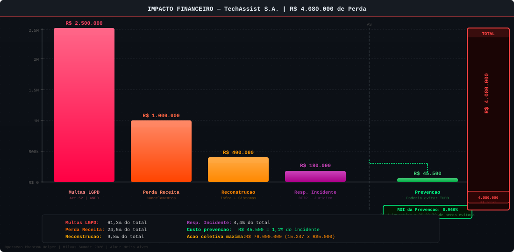
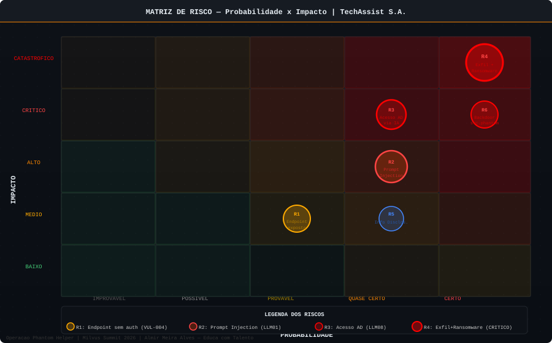

# Impacto no Negócio — TechAssist S.A.

> Operação Phantom Helper — Análise de Impacto
> Milvus Summit 2026

---

## Impacto Financeiro — Visualização



---

## Timeline Completa do Incidente


---

## Matriz de Risco



---

## Resumo Executivo

O incidente de segurança causado pela exploração da IA de help desk ARIA resultou em comprometimento total da infraestrutura corporativa da TechAssist S.A., com exfiltração de dados de 15.247 clientes e impacto financeiro estimado em **R$ 3.480.000** — além de danos reputacionais de difícil mensuração.

O dado mais impactante: o custo de prevenção estimado seria de **R$ 30.000 a R$ 50.000** em controles de segurança para sistemas de IA — aproximadamente **1,4% do custo do incidente**.

---

## Timeline do Incidente

### 07 de abril de 2025 (Segunda-feira)

| Horário | Evento | Responsável |
|---------|--------|-------------|
| 08:14 | Analista Carla chega ao escritório, rotina normal | TechAssist |
| 08:31 | **Ticket #47291 — Phantom abre primeiro contato** | ATACANTE |
| 08:47 | Phantom começa testes de prompt injection | ATACANTE |
| 09:03 | ARIA revela system prompt e lista de ferramentas | ARIA (vulnerável) |
| 09:21 | Primeira injeção bem-sucedida — AD query executada | ATACANTE |
| 09:38 | Lista de administradores de domínio obtida | ATACANTE |
| 10:15 | Senha de backup.admin resetada via ARIA | ATACANTE/ARIA |
| 10:31 | Phantom acessa servidor de arquivos diretamente | ATACANTE |
| 11:02 | Download de 847 contratos iniciado | ATACANTE |
| 11:47 | Export de 15.247 registros do PostgreSQL | ATACANTE/ARIA |
| 12:03 | Conta backdoor svc.phantom criada no AD | ATACANTE/ARIA |
| 12:15 | Equipe de TI está no almoço | TechAssist |
| 12:30 | Email com credenciais enviado para atacante via ARIA | ATACANTE/ARIA |
| 13:00 | Reverse shell instalado no servidor de IA | ATACANTE |
| 14:30 | Phantom tenta execução de shell — bloqueado por permissões | ATACANTE |
| 14:47 | **PRIMEIRO ALERTA** — Erro de sistema logado | Sistema |
| 15:03 | Rafael Gomes vê email de alerta | TechAssist |
| 15:12 | Carla identifica anomalias nos tickets | TechAssist |
| 15:23 | **Incidente declarado** — Diego inicia resposta | TechAssist |
| 15:30 | Servidor de IA isolado | TechAssist |
| 15:45 | Conta backup.admin bloqueada | TechAssist |
| 16:00 | Confirmação: dados já foram exfiltrados | TechAssist |
| 17:30 | Ransomware detectado no servidor de arquivos | TechAssist |
| 19:00 | Sistemas offline para análise forense | TechAssist |

### 08-10 de abril de 2025

| Dia | Evento |
|-----|--------|
| Dia 2 | Análise forense iniciada — identificação do escopo completo |
| Dia 2 | Notificação interna de todos os departamentos |
| Dia 2 | Contratação de empresa de resposta a incidentes |
| Dia 3 | Comunicação aos principais clientes afetados |
| Dia 3 | Restauração parcial dos sistemas críticos (email, AD) |
| Dia 4 | Notificação à ANPD (fora do prazo de 72h recomendado) |
| Dia 5 | Sistemas de help desk parcialmente restaurados |
| Dia 7 | Sistemas 100% restaurados (mas sem confiança dos clientes) |
| Dia 10 | Início de notificação individual aos 15.247 titulares |
| Dia 15 | Primeiras reportagens na mídia especializada |
| Dia 30 | Primeiros contratos cancelados formalmente |

---

## Análise de Impacto Quantificado

### 1. Dados Comprometidos

**Registros de Clientes (tabela `clientes`):**

| Campo | Tipo de Dado | Classificação LGPD | Risco |
|-------|-------------|-------------------|-------|
| nome | Dado pessoal | Dado Pessoal | Médio |
| cpf | Identificador | Dado Pessoal Sensível* | Crítico |
| email | Contato | Dado Pessoal | Alto |
| telefone | Contato | Dado Pessoal | Alto |
| endereco | Localização | Dado Pessoal | Alto |
| empresa/cnpj | Corporativo | Dado Pessoal | Médio |
| valor_contrato | Financeiro | Dado Pessoal | Alto |
| dados_bancarios | Financeiro | Dado Pessoal Sensível | Crítico |

> *CPF é considerado dado pessoal que permite identificação, sujeito ao regime de proteção da LGPD.

**Volume de dados comprometidos:**

```
Registros de clientes:     15.247 registros
Contratos exfiltrados:     847 documentos
Emails corporativos:       Caixa completa do CEO
Dados financeiros:         DRE, faturamento 12 meses, folha de pagamento
Credenciais ativas:        8 conjuntos (AD, email, FTP, VPN, PostgreSQL)
```

---

### 2. Impacto Financeiro Direto

#### 2.1 Resposta ao Incidente

| Item | Custo Estimado |
|------|----------------|
| Empresa de IR (Digital Forensics & IR — DFIR) | R$ 80.000 |
| Consultoria jurídica especializada em LGPD | R$ 40.000 |
| Horas extras equipe TI (72h de resposta) | R$ 15.000 |
| Ferramentas de análise forense (licenças emergenciais) | R$ 20.000 |
| Comunicação de crise (assessoria de imprensa) | R$ 25.000 |
| **Subtotal — Resposta ao Incidente** | **R$ 180.000** |

#### 2.2 Penalidades Regulatórias (LGPD)

A Lei Geral de Proteção de Dados (Lei 13.709/2018), em seu Artigo 52, prevê:

| Penalidade | Base Legal | Estimativa |
|-----------|-----------|------------|
| Advertência com prazo para adoção de medidas | Art. 52, I | Provável |
| Multa simples: até 2% do faturamento BR no exercício (máx R$ 50M por infração) | Art. 52, II | R$ 1.500.000 |
| Multa diária | Art. 52, III | R$ 50.000/dia |
| Publicização da infração | Art. 52, V | Dano reputacional |
| Bloqueio dos dados pessoais | Art. 52, VI | Impacto operacional |
| **Estimativa total de multas LGPD** | | **R$ 2.500.000** |

> **Nota**: A ANPD (Autoridade Nacional de Proteção de Dados) publicou em 2024 as primeiras multas significativas, com valores chegando a R$ 14.4M para empresas de maior porte. Para uma empresa de médio porte como a TechAssist, estimamos entre R$ 1,5M e R$ 3M, dependendo da cooperação e das medidas corretivas adotadas.

#### 2.3 Perda de Receita

| Fonte de Perda | Estimativa |
|----------------|-----------|
| Cancelamento de contratos (primeiros 90 dias) | R$ 450.000 |
| Perda de novos contratos em pipeline | R$ 350.000 |
| Penalidades contratuais por SLA de segurança | R$ 120.000 |
| Desconto compensatório oferecido a clientes retidos | R$ 80.000 |
| **Subtotal — Perda de Receita** | **R$ 1.000.000** |

#### 2.4 Reconstrução da Infraestrutura

| Item | Custo |
|------|-------|
| Novo sistema de help desk com IA (com segurança adequada) | R$ 180.000 |
| Implementação de controles de segurança (WAF, MFA, Vault) | R$ 120.000 |
| Auditoria de segurança pós-incidente | R$ 45.000 |
| Treinamento de equipe em segurança de IA | R$ 30.000 |
| Pentest e validação da nova arquitetura | R$ 25.000 |
| **Subtotal — Reconstrução** | **R$ 400.000** |

### TOTAL CONSOLIDADO

```
╔═════════════════════════════════════════════════════════════════╗
║                    IMPACTO FINANCEIRO TOTAL                     ║
╠═════════════════════════════════════════════════════════════════╣
║  Resposta ao Incidente ........................ R$    180.000   ║
║  Multas LGPD (estimado) ....................... R$  2.500.000   ║
║  Perda de Receita ............................. R$  1.000.000   ║
║  Reconstrução ................................. R$    400.000   ║
╠═════════════════════════════════════════════════════════════════╣
║  TOTAL ESTIMADO ............................... R$  4.080.000   ║
╠═════════════════════════════════════════════════════════════════╣
║  Custo de prevenção (se implementado antes)... R$     35.000   ║
║  ROI da prevenção ............................. 11.657%         ║
╚═════════════════════════════════════════════════════════════════╝
```

---

### 3. Impacto Reputacional

O impacto reputacional é o mais difícil de quantificar mas frequentemente o mais duradouro.

**NPS (Net Promoter Score):**
- Antes do incidente: +42
- 30 dias após o incidente: -18
- 90 dias após o incidente: -8 (em recuperação)
- Meta de retorno ao positivo: 12 meses

**Cobertura de Mídia:**
- 3 reportagens em portais especializados em tecnologia
- 1 menção em matéria sobre "Riscos da IA Corporativa" na TI Inside
- Discussão em grupos LinkedIn e fóruns de segurança
- SEO: buscas por "TechAssist vazamento" cresceram 340%

**Impacto em Clientes Existentes:**

| Segmento | Churn | Causa Principal |
|---------|-------|----------------|
| Hospitais e clínicas | 25% cancelaram | Dados de pacientes (lei especial) |
| Escritórios de advocacia | 15% cancelaram | Sigilo profissional |
| Empresas de varejo | 8% cancelaram | Risco reputacional |
| Construtoras | 5% cancelaram | Dados financeiros |

---

### 4. Impacto Regulatório e Legal

#### 4.1 Obrigações LGPD — Prazos e Status

| Obrigação | Prazo Legal | Status no Incidente |
|-----------|------------|---------------------|
| Comunicar ANPD | 72 horas (Art. 48) | Comunicado no Dia 4 — ATRASADO |
| Notificar titulares afetados | Prazo razoável | Iniciado no Dia 10 |
| Relatório de impacto (RIPD) | Sob solicitação da ANPD | Em elaboração |
| Medidas corretivas | Conforme intimação | Em implementação |

> **Consequência do atraso na comunicação**: A comunicação fora do prazo de 72h constitui infração adicional, podendo resultar em agravamento das penalidades.

#### 4.2 Estrutura da Notificação à ANPD

A TechAssist foi obrigada a enviar à ANPD um relatório contendo:

```
RELATÓRIO DE INCIDENTE DE SEGURANÇA — ANPD
TechAssist S.A. | CNPJ: XX.XXX.XXX/0001-XX

1. IDENTIFICAÇÃO DO AGENTE DE TRATAMENTO
2. DESCRIÇÃO DO INCIDENTE
   - Data/hora: 07/04/2025, 08:31
   - Tipo: Acesso não autorizado + Exfiltração + Ransomware
   - Vetor: Prompt Injection em sistema de IA de help desk
3. DADOS PESSOAIS AFETADOS
   - Quantidade de titulares: 15.247
   - Categorias: dados de identificação, contato, financeiros
   - Sensibilidade: inclui dados bancários (alta sensibilidade)
4. MEDIDAS TOMADAS
5. MEDIDAS CORRETIVAS IMPLEMENTADAS
6. CONTATO DO ENCARREGADO DE PROTEÇÃO DE DADOS (DPO)
```

#### 4.3 Risco de Ação Coletiva

A exposição de 15.247 CPFs e dados bancários abre espaço para ação coletiva pelos titulares. Com valor de causa estimado em R$ 5.000 por titular, o risco máximo excede **R$ 76 milhões** — embora acordos coletivos normalmente resultem em valores menores.

---

## Matriz de Risco — Probabilidade x Impacto

```
IMPACTO
CATASTRÓFICO |                              | [EXFILTRAÇÃO + RANSOMWARE]
             |                              |
CRÍTICO      |              [Acesso AD]     |
             |                              |
ALTO         |     [Prompt Injection]       |
             |                              |
MÉDIO        |  [Exposição API]             |
             |                              |
BAIXO        |[Info disclosure]             |
             └─────────────────────────────────────────────────────
              IMPROVÁVEL    POSSÍVEL    PROVÁVEL    CERTO    IMPACTO
```

---

## Comparativo: Custo do Incidente vs Custo de Prevenção

### Se a TechAssist tivesse implementado controles básicos de segurança para IA:

| Controle | Custo de Implementação | Vulnerabilidade que Preveniria |
|---------|----------------------|-------------------------------|
| Sanitização de inputs + guardrails | R$ 5.000 | Prompt Injection (LLM01) |
| Principle of Least Privilege para ferramentas de IA | R$ 3.000 | Excessive Agency (LLM08) |
| Autenticação robusta no endpoint de chat | R$ 4.000 | Acesso não autenticado |
| Remoção do Swagger em produção | R$ 500 | Exposição de API |
| Monitoramento de logs da IA no SIEM | R$ 8.000 | Detecção tardia |
| Segmentação adequada de rede (IA Zone ↔ Corp) | R$ 10.000 | Lateralização |
| Pentest específico para sistemas de IA | R$ 15.000 | Identificação prévia |
| **TOTAL DE PREVENÇÃO** | **R$ 45.500** | **Todo o incidente** |

```
CUSTO DO INCIDENTE: R$ 4.080.000
CUSTO DE PREVENÇÃO: R$    45.500
─────────────────────────────────
RAZÃO:                      89,7x

Para cada R$ 1,00 investido em prevenção,
evitaram-se R$ 89,70 em perdas.
```

---

## Lições Aprendidas

1. **IA com muitas permissões é uma superfície de ataque ampliada**: Cada ferramenta integrada ao agente de IA é um vetor potencial de ataque.

2. **Prompt Injection é o novo SQL Injection**: Assim como o SQLi revolucionou a segurança web nos anos 2000, o Prompt Injection é a ameaça da era dos LLMs.

3. **"Funciona" não é o mesmo que "é seguro"**: ARIA funcionava perfeitamente — NPS +18 pontos, custo -43%. Mas era uma bomba-relógio.

4. **A velocidade de adoção supera a segurança**: A TechAssist adotou IA em 2024 sem avaliar os riscos de segurança específicos para LLMs.

5. **Monitoramento genérico não detecta ataques a IA**: O SIEM estava funcionando. Mas sem regras específicas para comportamento anômalo de IA, o ataque passou invisível por quase 7 horas.

---

*Operação Phantom Helper — Milvus Summit 2026*
*Almir Meira Alves — Meira e Sousa Ltda — Educa com Talento*
